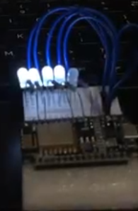

# Gesture Controlled LEDs

A gesture detection based control system for LEDS

## Description

A Computer vision program implemented in python to identify the number of finger-like contours in a predefined area of interest and make requests to a local HTML web server hosted on an ESP12 to control LEDs dynamically based on user gestures. 

### Dependencies

  #### Python
  
  * opencv-python
  * numpy
  * math
  * requests
  #### Arduino
  
  * ESP8266WiFi
  * ESP8266mDNS
  * ESPAsyncWebServer

### Hardware

  * NodeMCU Esp12 Dev Board
  * 5 LEDs
  * Breadboard
  * Laptop
  * Jumper cables
  

    
  

  

## Author

Samuel Kalu
  
* email : [samkalu@ttu.edu](mailto:samkalu@ttu.edu)
* linkedin : [@SamuelKalu](https://www.linkedin.com/in/samuel-kalu-74a359342/)

## Acknowledgments

Inspiration, code snippets, etc.
* [OpenCV](https://docs.opencv.org/4.x/index.html)

